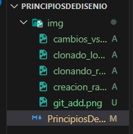

# sixflags
Análisis del Principios de Diseño de Sofware en CitiBanamex. 

# ¿Cómo usar Git con GitHub?

## Prerrequisitos

Antes de comenzar, asegúrate de tener Git instalado en tu computadora. Puedes descargarlo desde [git-scm.com](https://git-scm.com). Durante la instalación, elige algún editor de texto.

Después de la instalación, configura tu nombre de usuario y correo electrónico en Git ejecutando los siguientes comandos en tu terminal:

```bash
git config --global user.name "tu_nombre"
```

Verifica tu nombre configurado con:

```bash
git config user.name
```

```bash
git config --global user.email "tu_correo"
```

Verifica tu correo configurado con:

```bash
git config user.email
```

## Clonar un Repositorio

Antes de clonar un repositorio, asegúrate de estar en el directorio deseado en tu terminal. Luego, puedes clonar un repositorio desde GitHub con el siguiente comando:

```bash
git clone https://github.com/MrSheldonT/sixflags.git
```

Este comando descargará una copia del repositorio en tu máquina local. Si es necesario, inicia sesión en tu cuenta de GitHub.

Ahora, puedes realizar modificaciones en los archivos clonados. Recuerda agradecer cada vez que hagas un commit.

## Comandos Útiles

- **`git add .`** - Agrega todos los archivos modificados al área de preparación para el próximo commit.

- **`git reset .`** - Deshace los cambios en el área de preparación, pero mantiene los cambios en el directorio de trabajo.

- **`git commit`** - Crea un nuevo commit con los cambios en el área de preparación.

- **`git checkout -- .`** - Descarta los cambios en el directorio de trabajo para los archivos en el área de preparación.

- **`git log`** - Muestra el historial de commits.

- **`git commit --amend`** - Modifica el commit más reciente, permitiendo cambiar el mensaje o agregar más cambios.

- **`git checkout -b rama-parque`** - Crea y cambia a una nueva rama llamada "rama-parque".

- **`git checkout master`** - Cambia a la rama "master".

- **`git branch -d rama-tiendas`** - Elimina la rama "rama-tiendas".

- **`git push`** - Sube los cambios al repositorio remoto.

- **`git commit -am`** - Realiza un commit que incluye todos los archivos modificados en el repositorio (sin necesidad de usar `git add` previamente).

- **`git merge rama`** - Fusiona la rama especificada con la rama actual.

## Ya tengo instalado git ¿Cómo subo mis tablas?

1. **Abrir la Terminal:**
   - Abre la terminal en tu sistema operativo.
2. **Ubicarse en el Directorio de Destino:**
   - Utiliza el comando `cd` para navegar al directorio donde deseas clonar el repositorio. Por ejemplo:
     ```bash
     cd ruta/del/directorio
     ```

3. **Clonar el Repositorio:**
   - Utiliza el comando `git clone` seguido de la URL del repositorio en GitHub.
     ```bash
     git clone https://github.com/MrSheldonT/PrincipiosDeDisenio
     ```
   
   - Este comando descargará una copia del repositorio en tu máquina local.

   
4. **Crear tu rama de cambios:** 
   - Esta rama o lugar será donde trabajarás, serás tu copia para realizar cambios.
   ```bash
   git checkout -b nombre-de-la-rama
   ```
   Crea una rama con nombre SIGNIFICATIVO.
   
5. **Hacer Cambios:**
   - Realiza las modificaciones necesarias en los archivos del repositorio.
   Para facilitarlo yo usé Visual Studio Code, no estoy seguro que funcione con todos, pero al hacer `code .` permite abrir una ventana de Visual Studio Code enseñando el área de trabajo.
   
6. **Agregar Cambios al Área de Preparación:**
   - Utiliza el comando `git add` para agregar los archivos modificados al área de preparación. ASEGURATE DE HACERLO SOLO SI ESTÁS EN LA CARPETA DE PrincipiosDeDisenio.
   
   ```bash
   git add .
   ```
   


   Como dato adicional, dependiendo de cuando hiciste el add se mostrará el estado de los archivos en el lado izquierdo, poniendo el cursor sobre el te mostrará el estado actual. 
   
 

7. **Realizar un Commit:**
   - Crea un nuevo commit con un mensaje descriptivo.
   ```bash
   git commit -m "Agregué los casos de uso del 20 al 40"
   ```
8. **Subir Cambios al Repositorio Remoto:**
   - Sube tu rama al repositorio remoto:
   ```bash
   git push origin nombre-de-la-rama
   ```

   
   Esto subirá los cambios al repositorio en GitHub.

## Crear el Pull Request en GitHub

1. Visita la página del repositorio en GitHub.
2. Selecciona la rama que acabas de subir.
3. Haz clic en el botón "Compare & pull request".

## Completar el Pull Request

1. Añade información adicional si es necesario.
2. Haz clic en el botón "Create pull request".

## Esperar revisión y fusionar

1. Espera a que otros revisen tus cambios.

## Fusionar el Pull Request

Después de la aprobación, puedes fusionar el pull request haciendo clic en el botón "Merge pull request" en la interfaz web de GitHub (esto no lo harás tú).
